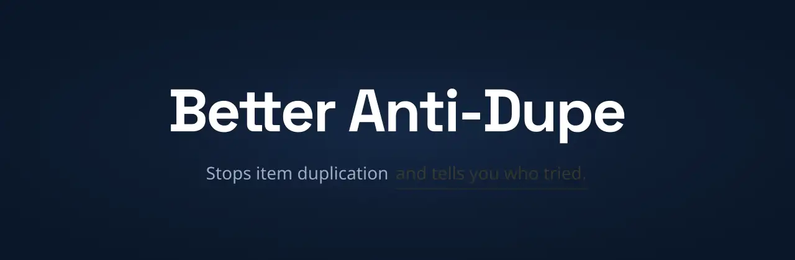

# BetterAntiDupe

**A forensic-grade item-duplication detector for Paper, Folia and Spigot servers.**

Most anti-cheat plugins focus on movement, reach and combat. BetterAntiDupe covers
the category they usually ignore: the steady drip of duped items that quietly
inflates your server's economy.

It works in two layers. The classic duping contraptions are **blocked outright**,
before an item ever exists. Everything else is caught by a **Chain of Custody
ledger** - an append-only, tamper-evident record of every item movement, reconciled
against what each player actually holds. If something doesn't add up, you get an
alert before the dupe spreads.

Items stack normally. Tracking attaches to the owner's UUID, not to per-item
identifiers, so vanilla behaviour is preserved.

## Install

1. Download the jar for your server:
   - `BetterAntiDupe-X.Y.Z.jar` - Minecraft 1.21.x (Java 21+)
   - `BetterAntiDupe-X.Y.Z-mc26.jar` - Minecraft 26.x (Java 25+)
2. Drop it into `plugins/`.
3. Start the server. It generates its config and a SQLite database, then loads.

That's it - the defaults are production-ready. To confirm it's working, mine a
diamond block and run `/adp ledger balance <your-name>`.

| | |
|---|---|
| **Server software** | Paper, Folia, Spigot, or a Paper-compatible fork (Purpur, Pufferfish, ...) |
| **Minecraft** | 1.21.0 - 1.21.11, 26.x |
| **Java** | 21+ for 1.21.x, 25+ for 26.x |
| **External services** | None. SQLite is bundled; Redis is optional for multi-server networks. |

## What it does

**Blocked outright** - rail, carpet, TNT and gravity dupers; phantom-GUI container
dupes; restart dupers. Each is a config toggle, all on by default.

**Detected by the ledger** - balance reconciliation, Proof of Witness, stack-clone
exploits, shulker and bundle laundering, item frames, entity inventories, hopper
laundering, workstation outputs, container transfers, villager trades, chunk-load
entity respawn, drop-pickup races, and acquisition-rate abuse (TMAR).

Every ledger entry is hash-linked to the previous one, and the hash covers the
audit details as well as the transaction, so editing the database directly breaks
the chain and `/adp ledger verify` reports exactly where.

The full coverage list, with the reasoning behind each detection, is in the
[user guide](docs/README.md#62-what-it-catches).

## Privacy

BetterAntiDupe reports anonymous usage statistics. The reason is practical: the
plugin works quietly and the docs are thorough, so almost nobody opens a ticket -
which leaves no way to know which Minecraft versions are actually running it.
Knowing that is what makes it possible to fight duplication exploits for those
versions first, instead of guessing.

Sent: storage backend, which prevention toggles are on, tracked-material count,
language, and whether shadow mode, auto-delete and tag hiding are enabled. Also
sent, as running totals since the last report: detection counts grouped by check
type, severity and item; items removed by enforcement, by item; and duper
contraptions blocked by type - aggregate counts only, so we can see whether the
plugin is actually catching anything and which items dupers target. Never sent:
IP addresses, server names, player names or UUIDs, coordinates, or ledger
contents. The statistics are kept private rather
than published on a public page - while the install base is small, public numbers
would tell dupers how likely any given server is to be protected.

Turn it off entirely with `metrics.enabled: false`.

Error reporting rides along by default: when the plugin hits an error it sends a
stack trace, redacted first so anything resembling a password, token, id or home
folder is stripped. Turn it off with `metrics.error_reporting: false`.

## Documentation

The full guide lives in **[docs/](docs/README.md)**, also published at
[esmp-fun.gitbook.io](https://esmp-fun.gitbook.io/plugins/better-anti-dupe).

- [Install](docs/getting-started/install.md)
- [When an alert comes in](docs/using-it/when-an-alert-comes-in.md)
- [Testing in-game](docs/help/testing-in-game.md)
- [Troubleshooting](docs/help/troubleshooting.md)
- [Changelog](CHANGELOG.md)
- [Report a bug](https://github.com/ESMP-FUN/BetterAntiDupe/issues)

Main command is `/antidupe` (aliases `/adp`, `/betterantidupe`). Permissions are
under `antidupe.*`.

## License

ESMP Source-Available License - see [LICENSE](LICENSE).
